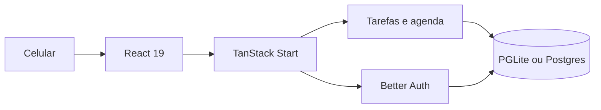

# Lista de tarefas — React + TanStack Start


Lista de tarefas para celular, com um fantasma branco que fica na tela e reage ao que você faz. Você escreve a tarefa, escolhe o dia na agenda e o mascote comemora, pensa ou cochila junto.

## 🧠 Por que este exemplo

Uma lista comum vira portfólio quando a interface responde na hora e tem personalidade. Em pouco código, o app cobre três coisas que aparecem em produto de verdade:

- **Ação otimista** — criar, concluir e apagar atualizam a tela antes do servidor confirmar
- **Estado por pessoa** — cada conta vê só as próprias tarefas
- **Companhia na interface** — o fantasma muda de pose (oi, pensando, comemorando, dormindo) sem sair do lugar

## 🏗️ Arquitetura



O front e as funções de servidor vivem no mesmo app. Sem `DATABASE_URL`, o banco é um PGLite local — o demo sobe com um comando. Com `DATABASE_URL`, as mesmas queries vão para o Postgres.

## 📱 O que dá para fazer

| Tela | O que faz |
| --- | --- |
| Entrar | Conta com e-mail e senha, ou Google |
| Tarefas | Escrever, concluir, apagar e reordenar |
| Agenda | Ver o que foi criado e escolher o dia de cada uma |
| Feitas | Lista do que já foi riscado |
| Conta | Perfil, dados salvos, contas, configurações, privacidade, notificações, ajuda e sair |

O fantasma só aparece depois do login. Dá para arrastar ele pelo canto e o balão de fala não cobre os botões.

## ✅ Testado no browser

Fluxo conferido com o app rodando (`npm run dev`), inclusive no tamanho de celular (390×844):

- Criar conta e entrar
- Adicionar tarefa e ver o emoji ao lado do texto
- Abrir a Agenda e marcar o dia
- Trocar de aba na barra de baixo (Tarefas, Agenda, Feitas)
- Mascote do mesmo tamanho em todas as poses, inclusive cochilando

## 🚀 Como rodar

### Pré-requisitos

- Node.js 20+
- npm

### 1. Instalar

```bash
npm install
```

### 2. Subir o app

```bash
npm run dev
```

Abra [http://localhost:8080](http://localhost:8080).

Crie uma conta com e-mail e senha (mínimo de 8 caracteres). As tarefas ficam no PGLite desta máquina. Para usar Postgres, defina `DATABASE_URL` antes de subir.

### 3. Checar tipos e build

```bash
npm run typecheck
npm run build
```

Variáveis opcionais:

| Variável | Padrão | Uso |
| --- | --- | --- |
| `DATABASE_URL` | vazio | Postgres. Sem ela, o app usa PGLite |
| `BETTER_AUTH_SECRET` | gerado no preview | Segredo da sessão em produção |
| `BETTER_AUTH_URL` | origem do app | URL pública usada no login |
| `VITE_AUTH_ENABLED` | `true` | Desligue só se a lista for local e sem conta |

## 📦 Stack

- **React 19 + TypeScript + Vite + Tailwind CSS 4** — interface escura, verde e pensada para o polegar
- **TanStack Start** — rotas e funções de servidor
- **Better Auth** — e-mail/senha e Google (OAuth). A senha do Google não fica no app
- **Zod** — validação do que entra na lista
- **PGLite ou Postgres** — tarefas, dias e sequência. A engrenagem abre o que está gravado no banco

## 🗺️ Relação com o desafio

Este projeto é um gestor de tarefas simples, no tamanho de um app de celular: escrever, marcar o dia e riscar. O diferencial de portfólio é o mascote, que reage sem atrapalhar o toque.

---

© 2026 Gabriel Teramae Chan. Todos os direitos reservados.
